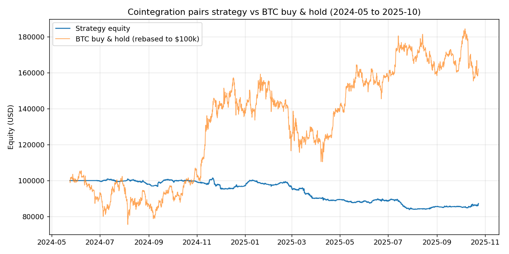

# Cointegration pairs trading (market-neutral BTC-beta strategy)

Statistical arbitrage for crypto perpetual futures. Find pairs of coins that are cointegrated, trade the spread when it stretches too far from its historical mean, size the two legs so the combined position has close to zero beta to BTC. Builds on an earlier project of mine, [Cointegrated Pairs Trading Bot](https://github.com/dkalenov/Cointegrated-Pairs-Trading-bot), extended to explicitly target BTC-beta neutrality.

This is a prototype, not a finished trading system. The market-neutral part works (0.007 beta to BTC on the backtest). The profitable part doesn't, not with the original parameters and costs tested. See [Results](#results).

## What's in this repo

- `coint_pairs/` - cointegration test, half-life, z-score, position sizing. Shared by the backtest and the live bot.
- `backtest/` - event-driven backtest engine and metrics.
- `bot/` - live/paper trading bot for Binance USDT-M futures, dry-run by default.
- `scripts/` - CLI to reproduce the backtest.
- `tests/` - unit tests + a mocked end-to-end test of the bot's trading cycle.
- `results/` - output of the backtest run below: equity curve, trade log, metrics, parameter sweep.

## Audit: the original prototype didn't work

Started from an earlier prototype that scanned for cointegrated pairs but never simulated a trade. Three bugs found going through it:

- **No imports.** The worker script didn't import `numpy`, `pandas`, or its own cointegration function. Never actually run.
- **Silent failure even after fixing that.** The hedge ratio was pulled out of an OLS fit with `.iloc[1]`, which only works on a pandas Series. The script fed it numpy arrays, so every call threw `AttributeError`, caught by a bare `except Exception:`, and returned `hedge = nan`. Zero pairs found, always, no error shown.
- **Double log transform.** The script passed already log-transformed prices into a function that logs its input again internally (confirmed: the matrix was literally named `logmat`). Would've silently produced a wrong hedge ratio if the bug above hadn't masked it first.

There was also no backtest, just a scanner logging a row whenever a rolling window crossed the z-score threshold. No entry/exit tracking, no PnL, no fees.

Fixed in `coint_pairs/stats.py`, with a regression test in `tests/test_stats.py` covering both bugs.

## How the backtest works

Walks forward bar by bar, no lookahead:

- Every 30 bars (5 days, 4h candles), re-screens the universe: Engle-Granger cointegration (p < 0.05), half-life under 200 bars, pair beta vs BTC under 0.1. Hedge ratio fixed at the rescan value until the next one.
- Every bar, computes a z-score per eligible pair from a trailing 200-bar window.
- Entry at |z| >= 2, exit at |z| <= 0.5. Sizing splits 5% of capital between the two legs by inverse volatility.

Added on top, since the original design didn't specify risk management:

- Hard stop at |z| >= 4, max holding period of 60 bars.
- Stop-loss at 1% of capital per pair (the design doc names this figure but the sizing formula it specifies doesn't enforce it, so it's implemented as an actual stop instead).
- Position closes if the pair fails the cointegration screen at a rescan while open.
- 5bps taker fee + 5bps slippage per fill, both legs, both sides. Funding rate is not modeled (not in the dataset), so real performance would likely run somewhat worse than backtested.

The cointegration test uses a fixed ADF lag for speed (`maxlag=1`), checked against the default `autolag='aic'` on a 400-window sample: 95% agreement.

## Universe and data

4h klines, 328 symbols, 2024-05-24 to 2025-10-24, clean (no dupes, no gaps). Universe is the 60 most liquid symbols with full history for the period, 1770 possible pairs.

## Results

$100,000 starting capital, 2024-05-23 to 2025-10-23 (~1.4 years):

| Metric | Value |
|---|---|
| Total return | -12.77% |
| CAGR | -9.18% |
| Max drawdown | -17.39% |
| Sharpe | -1.36 |
| Beta vs BTC | 0.007 |
| Trades | 1,594 |
| Win rate | 51.76% |
| Avg holding period | 2.06 days |
| Total costs paid | $15,954 |



Beta of 0.007 to BTC means the market-neutral hedging works, the equity curve barely reacts to BTC's swings over the period. It just doesn't make money after costs: gross PnL before fees/slippage was about +$3,183, small but positive, and $15,954 in costs across 1,594 trades wiped it out.

| Exit reason | Trades | Net PnL |
|---|---|---|
| Target (z reverted) | 457 | +$48,406 |
| Stop divergence | 368 | -$46,769 |
| Screen failed (pair stopped qualifying) | 758 | -$13,766 |
| Max holding / end of backtest | 11 | -$686 |

758 of 1,594 trades closed because the pair stopped passing the cointegration screen 5 days later, not because of price. A pair testing as "cointegrated" on a 200-bar window holds up for the next 5 days less than half the time in this data, likely a mix of multiple-testing noise (screening ~1770 pairs at p < 0.05) and genuinely shifting correlation structure in crypto.

### Parameter sensitivity

Tested two things: whether a longer formation window fixes the screen-failed churn, and how sensitive results are to the entry/exit thresholds. Full sweep in `results/parameter_sweep.json`.

A 400-bar window (vs. 200) made things worse, not better: -17.25% return, Sharpe -2.2. Window length isn't the cause of the churn above.

Entry/exit thresholds mattered more:

| z-entry | z-stop | Trades | Return | Sharpe |
|---|---|---|---|---|
| 2.0 (original) | 4.0 | 1,594 | -12.77% | -1.36 |
| 3.0 | 5.0 | 775 | -0.46% | -0.04 |
| **4.0** | **5.0** | 348 | **+0.69%** | **0.15** |
| 4.5 | 6.0 | 194 | +0.04% | 0.02 |
| 5.0 | 7.0 | 118 | -0.33% | -0.10 |

Fewer, higher-conviction entries with a wider stop takes this from clearly losing to roughly flat. This was found by searching parameter combinations against the same period the results are reported on, it's not out-of-sample validated, and the repo's defaults haven't been changed to match it.

## What I'd check next

- Out-of-sample validation of the z=4/stop=5 region, on data not used to find it.
- Funding rate, not modeled at all here.
- Slippage assumptions (5bps) are a guess, not measured from order book depth.
- What's actually driving the screen-failed churn, since window length wasn't it.

## Running it

```bash
git clone <this repo>
cd cointegration-pairs-bot
python -m venv .venv && source .venv/bin/activate  # .venv\Scripts\activate on Windows
pip install -r requirements.txt
```

### Reproduce the backtest

Needs a klines CSV with columns `Date,Open,High,Low,Close,Volume,Symbol`. The full scan is slow (~10-15 min on one core for 60 symbols), so it's split into a checkpointed precompute step and the backtest itself:

```bash
python scripts/precompute_rescans.py --csv path/to/klines.csv --universe 60 \
    --checkpoint results/rescans.pkl --max-seconds 240
# rerun the same command if it prints PARTIAL, it resumes

python scripts/run_backtest.py --csv path/to/klines.csv --universe 60 \
    --out results --rescans-checkpoint results/rescans.pkl
```

### Run the bot (paper mode, no API key needed)

```bash
python bot/main.py --once        # one cycle
python bot/main.py --loop        # runs continuously, sleeps between 4h candles
```

With no `.env` at all it fetches real market data from Binance (public, no auth) and logs what it would trade, no orders sent. Copy `.env.example` to `.env` to change parameters, capital, or universe.

Async, built on `ccxt.async_support`. Places a reduce-only STOP_MARKET on each leg on the exchange as a tail-risk backstop (`LEG_STOP_LOSS_PCT`, 15% default), separate from the strategy's real exit logic which is a joint z-score across both legs and runs every polling cycle.

To place real orders: `DRY_RUN=false` plus real `BINANCE_API_KEY`/`BINANCE_API_SECRET`, `USE_TESTNET=true` recommended first. Given the results above, I wouldn't point this at a real account without more validation work.

I could not test exchange connectivity against the real Binance API from the environment this was built in (no network access to Binance there). Covered by a mocked end-to-end test (`tests/test_bot_cycle.py`), but not a real API call. Test on testnet before trusting it, especially `exchange.py::place_protective_stop`.

### Run the tests

```bash
pytest tests/ -v
```

## Repo layout

```
coint_pairs/
  stats.py       cointegration test, half-life, z-score, beta
  sizing.py      volatility-parity position sizing
  data.py        CSV loading, universe selection, price matrix
backtest/
  engine.py      event-driven backtest engine
  metrics.py     performance metrics
bot/
  config.py      settings from .env
  db.py          sqlite state: positions, trades, daily PnL
  exchange.py    Binance USDT-M futures via ccxt (async)
  strategy.py    screening + signals, reuses coint_pairs/
  risk.py        portfolio caps, daily loss kill switch
  execution/     order placement + position lifecycle
  main.py        entrypoint
scripts/         backtest CLI
results/         backtest output + parameter sweep
tests/
```

## Disclaimer

The strategy as originally specified lost money after realistic costs. A parameter region exists nearby that comes out close to breakeven on the same data, but it was found by searching, not validated out of sample. Not a signal to trade on.
